# openHop Repeater

Lightweight Python MeshCore repeater daemon built on `openhop_core`.

openHop Repeater is designed to run continuously on low-power Linux hardware such
as Raspberry Pi-class devices, Proxmox LXC containers, and network-attached
radio modems. It forwards LoRa packets, exposes a web dashboard, and provides
configuration tools for radio setup, policy management, monitoring, and
integrations.

## Contents

- [Overview](#overview)
- [Screenshots](#screenshots)
- [Supported Hardware](#supported-hardware)
- [Installation](#installation)
- [Configuration](#configuration)
- [Policy Engine](#policy-engine)
- [Upgrading](#upgrading)
- [Proxmox LXC Installation](#proxmox-lxc-installation)
- [Uninstallation](#uninstallation)
- [Docker Compose](#docker-compose)
- [Roadmap](#roadmap)
- [Contributing](#contributing)
- [Support](#support)
- [Disclaimer](#disclaimer)
- [License](#license)

## Overview

The repeater daemon runs as a background service and forwards LoRa packets using
the `openhop_core` dispatcher and routing stack. The project favors a simple,
hackable architecture:

- CherryPy provides a lightweight HTTP server for the web UI and API.
- The web interface supports setup, monitoring, logs, configuration, and updates.
- Packet routing, policy checks, storage, sensors, GPS, MQTT, and optional
  pyMC_Glass integration are kept in modular components.
- Hardware support covers direct SPI radios, CH341 USB-to-SPI adapters,
  pyMC TCP/USB modem firmware, and KISS serial modems.

Real-world deployment feedback is especially welcome. Dense networks, unusual
hardware, and production-style installations are the best way to find the rough
edges and make the repeater better for everyone.

## Screenshots

### Dashboard

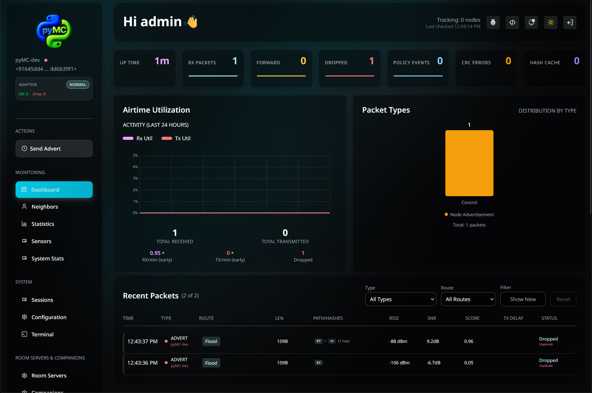

Real-time packet statistics, neighbor discovery, and system status.

### Statistics


Historical statistics and performance metrics.

## Supported Hardware

openHop Repeater supports these radio backends:

- **SX1262 over Linux SPI**: set `radio_type: sx1262`
- **SX1262 over CH341 USB-to-SPI**: set `radio_type: sx1262_ch341`
- **pyMC TCP modem**: set `radio_type: pymc_tcp`
- **pyMC USB-CDC modem**: set `radio_type: pymc_usb`
- **KISS serial modem**: set `radio_type: kiss`
- **No radio hardware**: set `radio_type: null` for setup, testing, or API-only work

> [!CAUTION]
> **Compatibility**
>
> This project targets single-radio SX1262-class transceivers and supported
> modem integrations. It does not support UART-only HATs or SX1302/SX1303
> concentrator boards.

| Interface | Status |
|-----------|--------|
| Native SX1262 SPI radio | Supported |
| CH341 USB-to-SPI bridge | Supported |
| pyMC TCP modem | Supported |
| pyMC USB-CDC modem | Supported |
| KISS serial modem | Supported |
| UART-only HATs | Not supported |
| SX1302/SX1303 concentrator boards | Not supported |

The following devices have out-of-the-box presets or known support:

| Device Name | Platform | TX Power | Connection | Radio Module | Link |
|-------------|----------|----------|:----------:|:------------:|------|
| HackerGadgets uConsole | uConsole / Raspberry Pi CM | Up to 22 dBm | SPI | SX1262-class | [View](https://www.clockworkpi.com/home-uconsole) |
| Zindello Industries UltraPeater | Luckfox | Up to 30 dBm | SPI | E22, E22P | [View](https://zindello.com.au/ultrapeater/) |
| MeshSmith PiMesh-1W | Raspberry Pi | Up to 30 dBm | SPI | E22P | [View](https://meshsmith.net/products/pimesh-1w) |
| MeshSmith EtherMesh-1W | Network | Up to 30 dBm | TCP | E22P | [View](https://meshsmith.net/products/ethermesh-1w) |
| Frequency Labs meshadv-mini | Raspberry Pi | Up to 30 dBm | SPI | E22 | [View](https://www.etsy.com/shop/FrequencyLabs) |
| Frequency Labs meshadv | Raspberry Pi | Up to 30 dBm | SPI | E22 | [View](https://www.etsy.com/shop/FrequencyLabs) |

Always confirm pin mappings, antenna setup, regional frequency rules, and TX
power limits before transmitting.

## Installation

### Install Git

```bash
sudo apt update
sudo apt install git -y
```

### Clone The Repository

```bash
git clone https://github.com/openhop-dev/openhop-repeater.git
cd openhop-repeater
```

### Quick Install

```bash
sudo bash ./manage.sh install
```

The installer will:

- Create a dedicated `repeater` service user with hardware access
- Install application files to `/opt/openhop_repeater`
- Create the configuration directory at `/etc/openhop_repeater`
- Create the log directory at `/var/log/openhop_repeater`
- Launch the interactive radio and hardware setup wizard
- Install and enable the `openhop-repeater` systemd service

After installation:

```bash
# View live logs
sudo journalctl -u openhop-repeater -f
```

Open the web dashboard at:

```text
http://<repeater-ip>:8000
```

### Development Install

```bash
pip install -e .
```

For development tools:

```bash
pip install -e ".[dev]"
```

## Configuration

The main configuration file is created during installation:

```text
/etc/openhop_repeater/config.yaml
```

### Setup Wizard

The web-based setup flow guides you through repeater identity, hardware
selection, radio presets, and login setup.

#### Start Setup

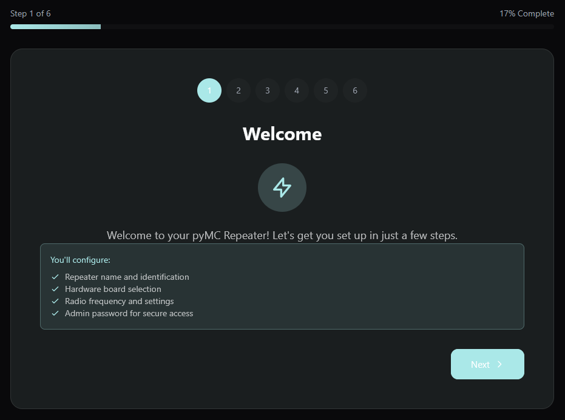

#### Repeater Name

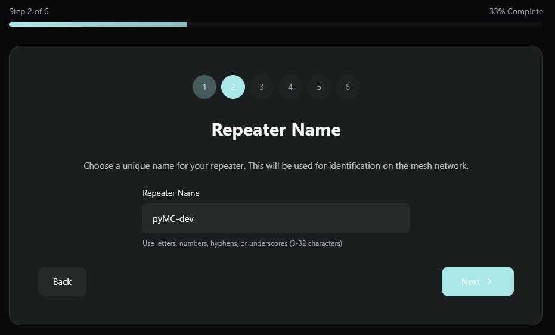

#### Hardware Type

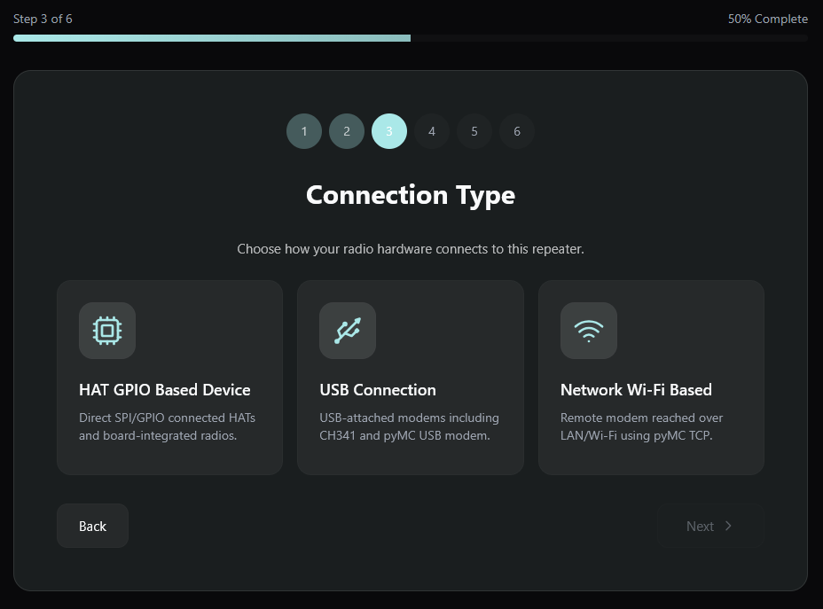

#### Choose A Preset

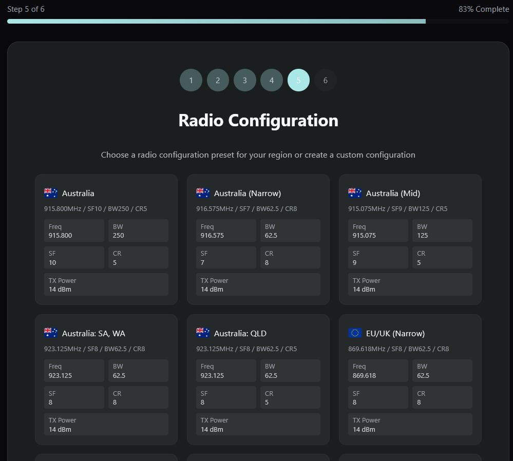

#### TX Power

TX power defaults to 14 dBm and can be changed later.

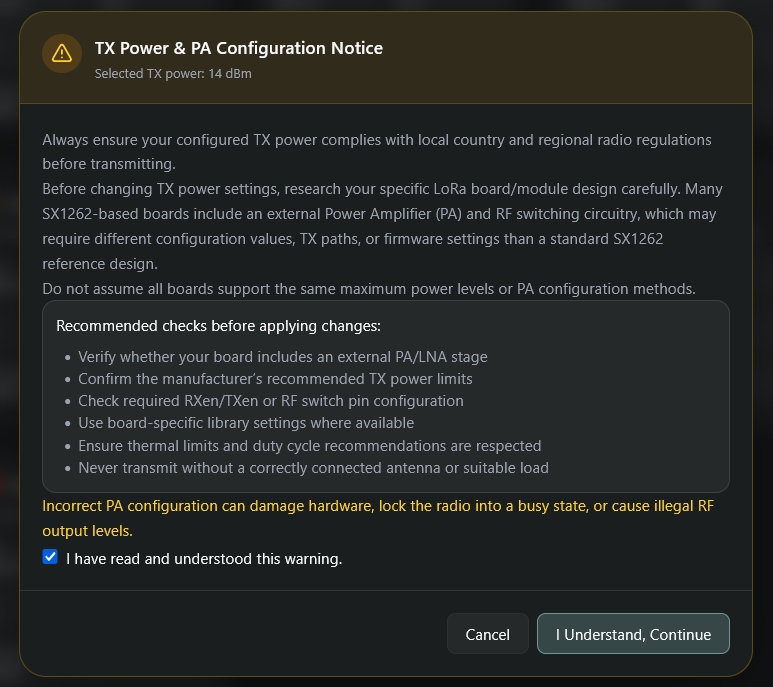

#### Set A Password

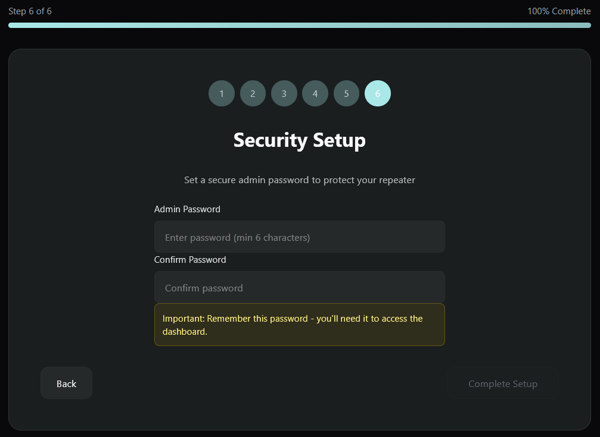

#### Update TX settings

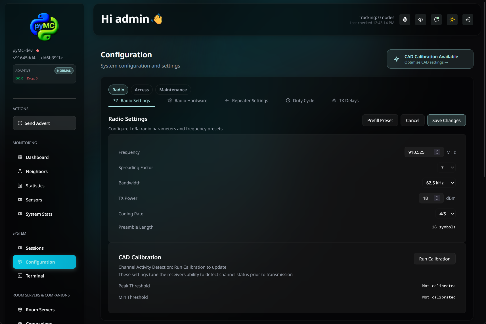

#### Run CAD Calibration

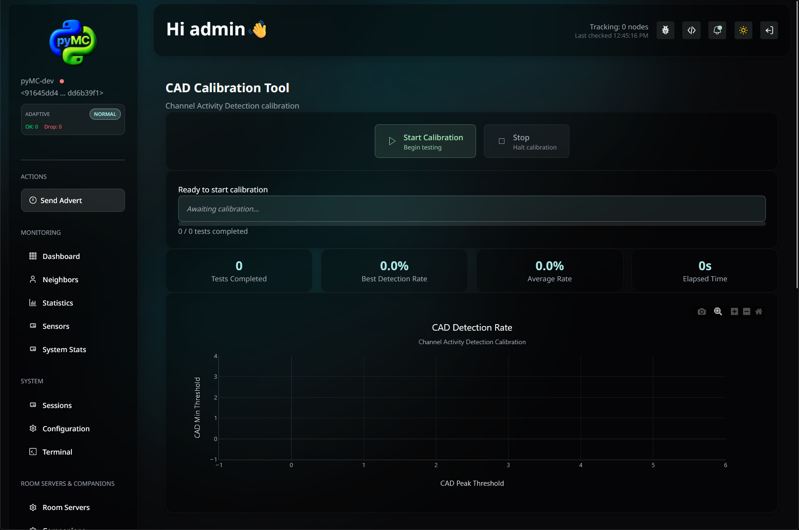

### Reconfigure Radio And Hardware

To reconfigure radio and hardware settings after installation:

```bash
sudo bash setup-radio-config.sh /etc/openhop_repeater
```

You can also launch the management menu:

```bash
sudo ./manage.sh
sudo systemctl restart openhop-repeater
```

### Optional pyMC_Glass Integration

openHop Repeater supports an optional `glass` configuration section for
pyMC_Glass control-plane integration. When enabled, the repeater sends periodic
`/inform` payloads to pyMC_Glass, receives queued commands, and reports command
results on the next inform cycle.

Minimal example:

```yaml
glass:
  enabled: true
  base_url: "http://localhost:8080"
  inform_interval_seconds: 30
```

## Policy Engine

Use the policy engine to create packet management rules from the
web interface.

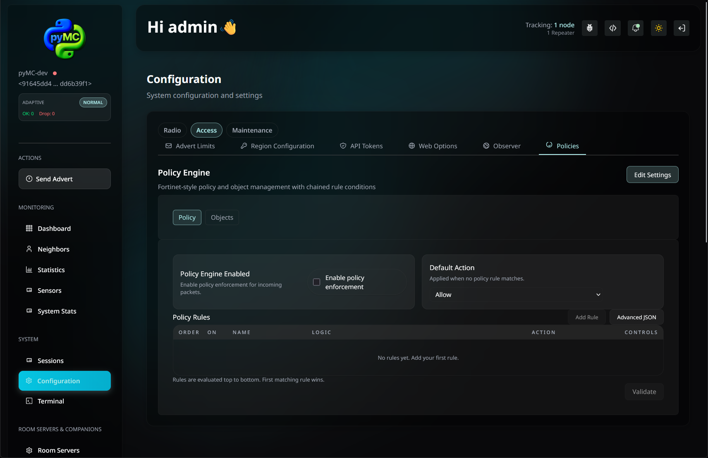

### Example: Drop Channel packets over two hops
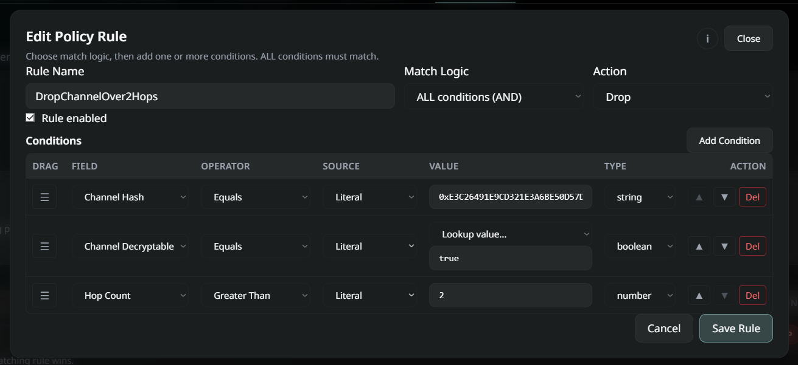

## Upgrading

### Web Interface

The web interface can upgrade an installation or switch branches.

> [!NOTE]
> Docker installs cannot be upgraded or branch-switched from the web interface.
> Update the container image instead.

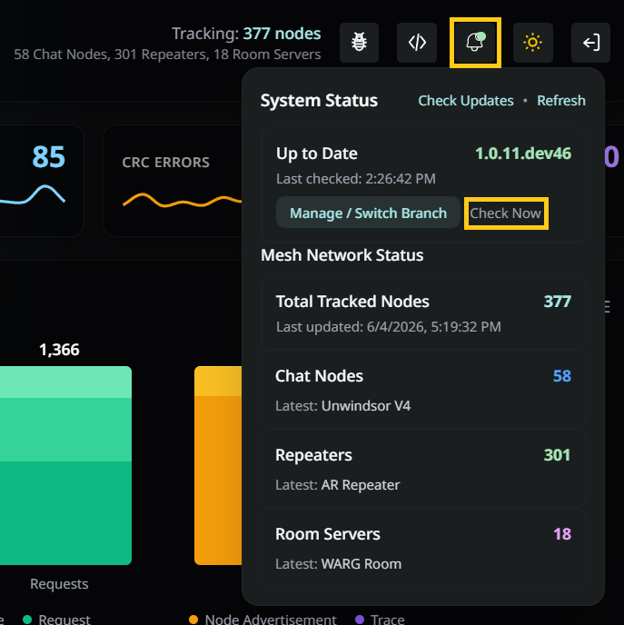

### CLI

```bash
cd openhop-repeater
sudo bash ./manage.sh upgrade
```

The upgrade script will:

- Pull the latest code from the main branch
- Update application files
- Upgrade Python dependencies if needed
- Restart the service automatically
- Preserve the existing configuration

## Proxmox LXC Installation

openHop Repeater can run inside a Proxmox LXC container using a CH341 USB-to-SPI
adapter or a TCP modem. This is useful for headless, always-on deployments
without dedicating a full Raspberry Pi.

### Requirements

Software:

- Proxmox VE 7.x or 8.x host
- Internet access for the container

Hardware, choose one:

- CH341 USB-to-SPI adapter with VID `1a86` and PID `5512`, connected to the
  Proxmox host and wired to an SX1262-based LoRa module such as an Ebyte
  E22-900M30S
- TCP modem, such as MeshSmith EtherMesh

### One-Line Install

Run this command on the Proxmox host, not inside a container:

```bash
bash -c "$(curl -fsSL https://raw.githubusercontent.com/pyMC-dev/openhop-repeater/main/scripts/proxmox-install.sh)"
```

Replace `main` in the URL with another branch name if needed.

The installer will prompt for container settings (container ID, hostname, RAM,
disk, bridge, etc.) and then:

1. Download a Debian 12 LXC template.
2. Create a privileged container with USB passthrough.
3. Install a host-side udev rule for the CH341 device.
4. Clone the repository and pre-seed CH341 GPIO pin mappings.
5. Run `manage.sh install` inside the container.
6. Display the dashboard URL.

### Default Container Settings

| Setting | Default |
|---------|---------|
| Container ID | Next available |
| Hostname | `openhop-repeater` |
| RAM | 1024 MB |
| Disk | 4 GB |
| CPU cores | 2 |
| Bridge | `vmbr0` |
| Storage | `local-lvm` |
| Password | `pymc` |

### After Installation

```bash
# Enter the container
pct enter <CTID>

# View service logs
journalctl -u openhop-repeater -f

# Manage the repeater
cd /opt/openhop_repeater
bash manage.sh
```

Open the dashboard at:

```text
http://<container-ip>:8000
```

### CH341 GPIO Pin Mapping

The Proxmox installer pre-configures CH341 GPIO pins for an E22 module. These
are not Raspberry Pi BCM pin numbers:

| Function | CH341 GPIO | Pi BCM Default |
|----------|-----------:|---------------:|
| CS | 0 | 21 |
| RXEN | 1 | -1 |
| Reset | 2 | 18 |
| Busy | 4 | 20 |
| IRQ | 6 | 16 |

The installer also enables `use_dio3_tcxo` and `use_dio2_rf` for E22 modules.

### Troubleshooting

- **USB device not found**: confirm the CH341 is plugged into the Proxmox host
  and appears in `lsusb -d 1a86:5512`.
- **Permission denied on USB**: the installer creates
  `/etc/udev/rules.d/99-ch341.rules`. Run `udevadm trigger` on the host if
  needed.
- **Container cannot see USB**: verify USB passthrough lines exist in
  `/etc/pve/lxc/<CTID>.conf`:

  ```text
  lxc.cgroup2.devices.allow: c 189:* rwm
  lxc.mount.entry: /dev/bus/usb dev/bus/usb none bind,optional,create=dir 0 0
  ```

- **NoBackendError for libusb**: the installer installs `libusb-1.0-0`
  automatically. If needed, run `apt-get install libusb-1.0-0` inside the
  container.

## Uninstallation

```bash
sudo bash ./manage.sh uninstall
```

The uninstaller will:

- Stop and disable the systemd service
- Remove the installation directory
- Optionally remove configuration, logs, and user data
- Optionally remove the service user account

The script prompts before each optional removal step.

## Docker Compose

You can run openHop Repeater in Docker using the published image.

Copy `.env.example` to `.env` before starting:

```bash
cp .env.example .env
```

Set `DIALOUT_GID`, `GPIO_GID`, and `SPI_GID` from `getent group dialout`,
`getent group gpio`, and `getent group spi` if your host values are different.

Default storage should use Docker named volumes. This avoids Portainer creating
root-owned `./config` and `./data` bind mount folders on first start. If you
want host bind mounts, use absolute host paths and pre-create/chown them to
`15888:15888`.

Do not mount `./config.yaml:/etc/openhop_repeater/config.yaml`; Docker can create
that source as a directory, which breaks startup.

### Setup

1. Copy `.env.example` to `.env`.
2. Review `.env` and update `PYMC_REPEATER_IMAGE`, `DIALOUT_GID`,
   `GPIO_GID`, or `SPI_GID` if needed.
3. Configure `docker-compose.yml` for your hardware and device paths.
4. Uncomment the USB device mapping only if your host has that device path.
5. Pull and start the container.

```bash
docker compose up -d
```

### Example `docker-compose.yml`

```yaml
services:
  openhop-repeater:
    image: ${PYMC_REPEATER_IMAGE:-pymcdev/openhop-repeater:main}
    container_name: openhop-repeater
    restart: unless-stopped
    ports:
      - 8000:8000

    devices:
      # SPI devices. Your paths may differ. Remove if not using SPI hardware.
      - /dev/spidev0.0
      - /dev/gpiochip0

      # USB devices. Uncomment/change only if needed.
      # - /dev/bus/usb/002:/dev/bus/usb/002

    cap_add:
      - SYS_RAWIO

    group_add:
      - "${DIALOUT_GID:-20}"
      - "${GPIO_GID:-986}"
      - "${SPI_GID:-989}"
      - plugdev

    volumes:
      - ${PYMC_CONFIG_VOLUME:-openhop-repeater-config}:/etc/openhop_repeater
      - ${PYMC_DATA_VOLUME:-openhop-repeater-data}:/var/lib/openhop_repeater

volumes:
  openhop-repeater-config:
  openhop-repeater-data:
```

## Roadmap

- [ ] **Public map integration**: submit repeater location and details to a
  public map for discovery.
- [ ] **Remote administration over LoRa**: manage repeater configuration from
  the mesh.
- [ ] **Trace request handling**: respond to trace and diagnostic requests from
  the mesh network.

## Contributing

Contributions are welcome.

1. Fork the repository and clone your fork.
2. Create a feature branch from `dev`:

   ```bash
   git checkout -b feature/your-feature-name dev
   ```

3. Make your changes and test with real hardware when possible.
4. Commit with a clear message:

   ```bash
   git commit -m "feat: describe your change"
   ```

5. Push to your fork and open a pull request against `dev`.

Include a clear description, hardware tested, and any related issues.

### Development Setup

```bash
# Install in development mode with dev tools (ruff, pytest, mypy, etc)
pip install -e ".[dev]"

# Install pre-commit hooks
pip install pre-commit
pre-commit install

# Run checks manually
pre-commit run --all-files
```

Hardware support for LoRa radio drivers is included in the base installation
through `openhop_core[hardware]`.

Pre-commit hooks will automatically:
- Lint and auto-fix Python issues with Ruff
- Validate formatting with Ruff formatter
- Fix trailing whitespace and other file issues

## Support

- [pyMC Core](https://github.com/openhop-dev/openhop-core)
- [MeshCore Discord](https://meshcore.gg)

## Disclaimer

This software has been tested on actual hardware, but it is provided "as is"
without warranty of any kind, express or implied. No guarantee is made about
performance, compatibility, or suitability for any particular purpose.

By using this software, you acknowledge and agree that:

- You use it entirely at your own risk.
- The author is not responsible for hardware damage, data loss, or system
  failures.
- You are responsible for complying with local radio regulations and licensing
  requirements.
- No support or warranty is guaranteed, though community assistance may be
  available.

This software is intended for educational and experimental use. Always test in a
controlled environment before production deployment.

## License

This project is licensed under the MIT License. See [LICENSE](LICENSE) for
details.
